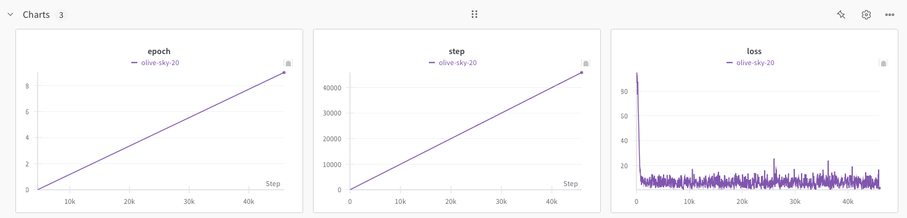

# Vision Language Model (VLM) for Autonomous Driving

## Overview

This project focuses on training a Vision Language Model (VLM) to drive a car in a simulated environment.

## Dataset

Coming soon...

## Installation
It is recommended to follow this order to avoid any issues with the installation.

To get started, clone the repository:

```bash
git clone https://github.com/xFranv8/vlm-ad.git
cd vlms
```

Then you will need to install pytorch with cuda support. You can do this by running the following commands (assuming you have conda installed):

```bash
conda create -n vlm-ad python=3.12.7
conda activate vlm-ad
conda install pytorch torchvision pytorch-cuda=12.4 -c pytorch -c nvidia
```

Next, install the rest of the dependencies:

```bash
pip install -r requirements.txt
```

## Wandb
You will need to create a wandb account. Access to the following link and create an account: [https://wandb.ai/site](https://wandb.ai/site/)
After creating an account, you will need to login using the following command:

```bash
wandb login
```

Then, you will need to paste your wandb API key, which you can find in your account.

## Training
Coming soon...

```bash
python train_vlm.py
```
## Evaluation

After training, you can evaluate the model's performance using the evaluation script:

```bash
python inference_vlm.py
```

## Results
Here you can see preliminary results of the model's performance with a dummy dataset, note that we are just starting with the project and 
measuring that it actually learns something.



## Contact

For any questions,inquiries and accessing to the dataset, please contact [fv8vazquez@gmail.com](fv8vazquez@gmail.com).